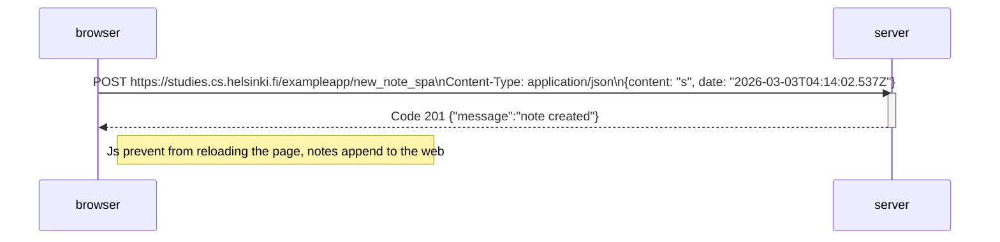

```mermaid
sequenceDiagram
    participant browser
    participant server
    browser->>server: POST https://studies.cs.helsinki.fi/exampleapp/new_note_spa\nContent-Type: application/json\n{content: "s", date: "2026-03-03T04:14:02.537Z"}
    activate server
    server-->>browser: Code 201 {"message":"note created"}
    deactivate server
    Note right of browser: Js prevent from reloading the page, notes append to the web

```